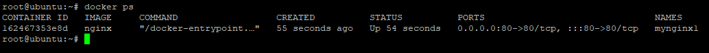
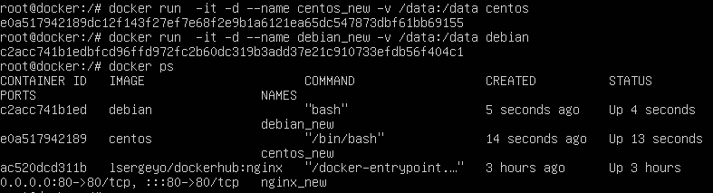
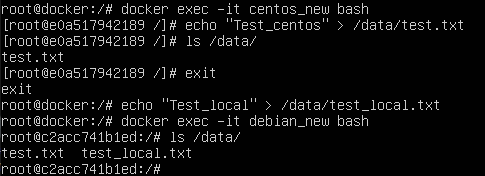

# devops-netology_5.3
devops-netology_5.3
1. 

https://hub.docker.com/r/lsergeyo/dockerhub/

2. 
- Высоконагруженное монолитное java веб-приложение - физическая машина для прямого доступа к ресурсам сервера без дополнительных "прослоек"; 
- Nodejs веб-приложение - Docker контейнер для веб-приложения (наиболее предпочтительный вариант для не высокозагруженных веб-приложений);  
- Мобильное приложение c версиями для Android и iOS - для быстрого развертывания/тестирования Docker контейнер;  
- Шина данных на базе Apache Kafka - Docker контейнер, быстрое развертывание через докер разработчикам, на сервера;  
- Elasticsearch кластер для реализации логирования продуктивного веб-приложения - три ноды elasticsearch, два logstash и две ноды kibana - виртуалка, организация кластера, удобно делать бэкапы;  
- Мониторинг-стек на базе Prometheus и Grafana - Docker контейнер, быстрое развертывание, кластеризация;  
- MongoDB, как основное хранилище данных для java-приложения - Виртуака, для БД и хранения данных, для высоконагруженной БД - физический сервер;  
- Gitlab сервер для реализации CI/CD процессов и приватный (закрытый) Docker Registry - Docker контейнер если необходимо масштабирование, либо можно виртуалку (удобный перенос, бэкапы).  

3. 
  

